><p style="font-size: 12px; color: brown;">"<em> A most gruesome and nerve-racking assignment to finish as my last module with SUSS in exchange for the master's certificate </em>"  </p>


This repository contains the visualization of data that I have done for ANL501 Data Visualisation and Storytelling course offered by the Master of Analytics and Visualisation (MAVI) programme at SUSS.

In this course, we explore the use of R programming to construct data visualizations. The course follows <a href="https://socviz.co/"> Data Visualization: A Practical Introduction </a> by Kieran Healy. The data can be found <a href="https://data.gov.sg/datasets?query=resale+flat+price+based+on+approval&page=1&resultId=189"> Resale Flat Price </a>.


# Singapore HDB Resale Market Trend From 1990 to the Present

**Author**: Sally Marcellina Yeo  

## Overview

This project analyzes the Singapore HDB resale market trends from 1990 to the present. The analysis uses various data visualization techniques to provide insights into key factors influencing the market, such as:

- Flat types
- Location
- Remaining lease years
- Regulatory measures
- Economic factors (e.g., interest rates)

The report also examines how significant economic events, such as the 1998 Asian Financial Crisis and the 2007 Global Financial Crisis, along with government interventions, impacted HDB resale prices.

## Key Features

- **Line Plots**: Visualize the time-series data for average prices per square foot (psf) across different periods.
- **Bar Charts**: Show transaction volumes over time to reflect market activity.
- **Scatter Plots**: Analyze the correlation between average psf prices and factors such as remaining lease years, flat types, and location.
- **Map Plots**: Present the average psf prices geographically across different towns in Singapore.

## Insights

- **Economic Impact**: Regulatory measures and economic factors like interest rates significantly influence the HDB resale market.
- **Price Determinants**: Flat type, age, and location have a strong impact on resale prices.
- **Government Measures**: Government interventions during financial crises helped stabilize the market.

## Project Structure

- **RMarkdown File**: The analysis is contained in the file `ANL501_ECA_Sallyyeo001_SallyMarcellinaYeo.Rmd`, which can be used to generate a Word document report.
- **Data Visualizations**: Includes a variety of plots (line plots, bar charts, scatter plots, map plots) to explore and understand market trends.

## The R Code
Here is the steps for importing the data in R Studio.

Setting the working directory

```{r, echo=F}
# set your working directory here
setwd("/Users/sallyyeo/Desktop/501ECA")
```

```{r import.data, echo=F}
df.resale.approved.1990to1999 = read.csv("ResaleFlatPricesBasedonApprovalDate19901999.csv")
df.resale.approved.2000to2012 = read.csv("ResaleFlatPricesBasedonApprovalDate2000Feb2012.csv")
df.resale.registered.2012to2014 = read.csv("ResaleFlatPricesBasedonRegistrationDateFromMar2012toDec2014.csv")
df.resale.registered.2015to2016 = read.csv("ResaleFlatPricesBasedonRegistrationDateFromJan2015toDec2016.csv")
df.resale.registered.2017topresent = read.csv("ResaleflatpricesbasedonregistrationdatefromJan2017onwards.csv")
```

Next, I check the data types and skim through the data

```{r check.data.type, include=F }
str(df.resale.approved.1990to1999)
str(df.resale.approved.2000to2012)
str(df.resale.registered.2012to2014)
str(df.resale.registered.2015to2016)
str(df.resale.registered.2017topresent)
```

```{r skim.data, include=F }
#install.packages("skimr")
library(skimr)

skim(df.resale.approved.1990to1999)
skim(df.resale.approved.2000to2012)
skim(df.resale.registered.2012to2014)
skim(df.resale.registered.2015to2016)
skim(df.resale.registered.2017topresent)
```

Following are the list of data issues found using str() and skim():

  * Data type of attribute "resale_price" are different between the data frames.
  * Different number of variables in the data frames.
  * Data type of the month is not date but character.
  * Different upper and lowercase values of attribute "flat_model".
  * Spelling difference for one of the attribute "flat_type" value.
  
Following are the data cleaning steps in order:

  * Convert the data type of "resale_price" to numeric to match with other data frames.
  * Extract the year value from the "remaining_lease" of 2017 to present data set using str_extract() from "stringr" library, and convert it from character to integer.
  * Merge all sorted data frames using bind_rows() from "dplyr" library.
  * Convert "month" variable to Date type.
  * Calculate the value of "remaining_lease" for all combined rows.
  * Convert all numeric data to integer since there is no decimal places needed.
  * Convert the values of "flat_model" variable to uppercase.
  * Replace "MULTI GENERATION" with "MULTI-GENERATION" in the "flat_type" column.
  * Create a new variable "floor_area_psf" to calculate the floor area in square foot.
  * Create a new variable "dollar_psf" to calculate the price per square foot (psf) of a flat. Analyzing the price in psf will be better the gauge the value of the house.

# Data Cleaning

Convert variables to the correct data types.

```{r data.cleaning, include=F}
#install.packages("stringr")
library(stringr)  # to use str_extract()

# convert variables to correct types
df.resale.approved.1990to1999$resale_price = as.numeric(df.resale.approved.1990to1999$resale_price)
df.resale.registered.2017topresent$remaining_lease <- as.integer(str_extract(df.resale.registered.2017topresent$remaining_lease, "\\d{2}"))
```

Combine all the data frames as one data frame.

```{r, include=F}
#install.packages("dplyr")
library(dplyr)  # to use bind_rows

# combine all data frames
data <- bind_rows(df.resale.approved.1990to1999, df.resale.approved.2000to2012, df.resale.registered.2012to2014, df.resale.registered.2015to2016, df.resale.registered.2017topresent)
```

Convert month to date type.

```{r, include=F}
#install.packages("zoo")
library(zoo)  # to use as.yearmon()

# convert variables to correct types
data$month <- as.Date(as.yearmon(data$month)) # using zoo package
```

Calculate the value of remaining lease for all combined rows and convert numeric to integer.

```{r, include=F}
data %>%
  mutate(remaining_lease = 99-(as.numeric(format(month,'%Y'))-lease_commence_date)) -> 
  data

data %>% 
  mutate_if(is.numeric, as.integer) -> data
```

Checking unique values.

```{r, include=F}
# check for unique variable values
unique(data$flat_type)
unique(data$town)
unique(data$flat_model)

# convert to uppercase
data$flat_model <- toupper(data$flat_model)

# replace all the "MULTI GENERATION" to "MULTI-GENERATION"
data$flat_type <- gsub("MULTI GENERATION", "MULTI-GENERATION", data$flat_type)
```

Calculate the floor area in sqf and the dollar per sqf.

```{r, include=F}
# calculate floor area in sqf
data$floor_area_sqf <- round(data$floor_area_sqm * 10.764)

# create new variable "dollar_psf"
data %>%
  mutate(dollar_psf = resale_price/floor_area_sqf) -> data
```

Overview of the clean data:

``` {r head.ten, echo=F}
str(data)
```

Output:

```{plaintext}
'data.frame':	920241 obs. of  11 variables:
 $ month              : chr  "1990-01" "1990-01" "1990-01" "1990-01" ...
 $ town               : chr  "ANG MO KIO" "ANG MO KIO" "ANG MO KIO" "ANG MO KIO" ...
 $ flat_type          : chr  "1 ROOM" "1 ROOM" "1 ROOM" "1 ROOM" ...
 $ block              : chr  "309" "309" "309" "309" ...
 $ street_name        : chr  "ANG MO KIO AVE 1" "ANG MO KIO AVE 1" "ANG MO KIO AVE 1" "ANG MO KIO AVE 1" ...
 $ storey_range       : chr  "10 TO 12" "04 TO 06" "10 TO 12" "07 TO 09" ...
 $ floor_area_sqm     : num  31 31 31 31 73 67 67 67 67 67 ...
 $ flat_model         : chr  "IMPROVED" "IMPROVED" "IMPROVED" "IMPROVED" ...
 $ lease_commence_date: int  1977 1977 1977 1977 1976 1977 1977 1977 1977 1977 ...
 $ resale_price       : num  9000 6000 8000 6000 47200 46000 42000 38000 40000 47000 ...
 $ remaining_lease    : int  NA NA NA NA NA NA NA NA NA NA ...
```

# Data Analysis

Aggregating data and assigned to new data frame

``` {r data.processing.general.line.plot, echo=F}
# create a new data frame and aggregrate on the date to get the average psf
psf_df <- data %>%
  group_by(month) %>%
  summarise(average_dollar_psf = mean(dollar_psf))
```

Line plot showing average price psf annually

``` {r general.line.plot.psf, echo=F}
##### line plot average price psf per year #####
#install.packages("ggplot2")
library(ggplot2)

# plot using average_dollar_psf with ribbon
ggplot(psf_df, aes(x = month, 
                 y = average_dollar_psf)) +
  geom_line() +
  geom_ribbon(aes(xmin = as.Date("1997-07-01"), 
                  xmax = as.Date("2007-09-30"), 
                  y = average_dollar_psf), 
              fill="red", 
              alpha=0.5, 
              inherit.aes = F) +
  geom_ribbon(aes(xmin = as.Date("2009-01-01"), 
                xmax = as.Date("2014-12-31"), 
                y = average_dollar_psf), 
            fill="red", 
            alpha=0.5, 
            inherit.aes = F) +
  geom_ribbon(aes(xmin = as.Date("2020-04-01"), 
                  xmax = as.Date("2024-02-01"), 
                  y = average_dollar_psf), 
              fill="red", 
              alpha=0.5, 
              inherit.aes = F) +
  scale_y_continuous(labels = scales::dollar_format(prefix = "$"), 
                     breaks = seq(0, 
                                  max(psf_df$average_dollar_psf), 
                                  by = 50)) +
  scale_x_date(breaks = seq(as.Date("1990-01-01"), 
                            as.Date("2024-02-01"), 
                            by = "1 years"), 
               date_labels = "%Y") +
  labs(title = "Average Price psf of Resale HDB\nfrom 1990 to 2024",
       x = "Year",
       y = "Average Price psf (SGD)") +
  theme_minimal() +
  theme(axis.text.x = element_text(angle = 90, 
                                   hjust = 1),
        plot.title = element_text(size = 10)) +
  ylim(0, 650)
```

Output:

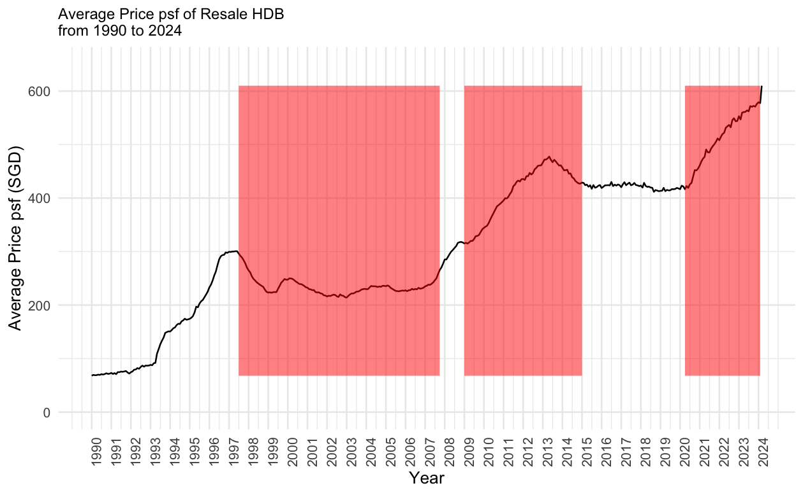

Filter data for specific period of time.

``` {r data.processing.post.AFC.GFC, echo=F}
##### data processing for line plot post AFC 1997 Q3 - 2008 Q4 #####
# create a quarter variable
data$quarter <- as.yearqtr(data$month)

# filter data from 1997 Q3 - 2008 Q4
post_afc_df <- data[data$quarter >= "1997 Q3" & data$quarter <= "2008 Q4", ]

# create a new data frame and aggregrate by date
# to get the average psf for post 1998 AFC
post_afc_psf_df <- post_afc_df %>%
  group_by(month) %>%
  summarise(average_dollar_psf = mean(dollar_psf))

# Calculate the data points for drawing dashed line using geom_segment()
initial_point <- post_afc_psf_df %>% filter(month == as.Date("1997-07-01"))
lowest_point <- post_afc_psf_df %>% filter(average_dollar_psf == min(average_dollar_psf))
highest_point <- post_afc_psf_df %>% filter(average_dollar_psf == max(average_dollar_psf))

# create a transaction volume data frame for post AFC
txn_volume_df <- data %>% 
  group_by(year = year(month)) %>% 
  summarise(num_txn = n()) # to prevent error message

txn_volume_post_afc_df <- subset(txn_volume_df, 
                        year >= 1997 & year <= 2008)
```

Combine line plot and bar chart showing transaction volume and price psf post AFC.

``` {r plot.post.AFC, echo=F}
##### line plot for post AFC #####
#install.packages("tidyverse)
library(tidyverse) # for data manipulation

#install.packages("patchwork")
library(patchwork) # for combining plots in one

# assign ggplot to post_afc_psf_plot so it can be combined to other plot later on
post_afc_psf_plot <- ggplot(post_afc_psf_df, 
                         aes(x = month, 
                             y = average_dollar_psf)) +
  geom_line() +
  geom_segment(aes(x = initial_point$month, 
                   y = initial_point$average_dollar_psf,
                   xend = lowest_point$month, 
                   yend = lowest_point$average_dollar_psf),
               linetype = "dashed", 
               color = "red") +
  # to draw dashed line to the geom_line()
  geom_segment(aes(x = lowest_point$month, 
                   y = lowest_point$average_dollar_psf,
                   xend = highest_point$month, 
                   yend = highest_point$average_dollar_psf),
               linetype = "dashed", 
               color = "blue") +
  # to label data points
  geom_text(aes(x = initial_point$month, 
                y = initial_point$average_dollar_psf, 
                label = round(initial_point$average_dollar_psf)),
            vjust = -0.5, 
            hjust = -0.5, 
            color = "green") +
  geom_text(aes(x = lowest_point$month, 
                y = lowest_point$average_dollar_psf, 
                label = round(lowest_point$average_dollar_psf)),
            vjust = 0, 
            hjust = -1, 
            color = "blue") +
  geom_text(aes(x = highest_point$month, 
                y = highest_point$average_dollar_psf, 
                label = round(highest_point$average_dollar_psf)),
            vjust = 1, 
            hjust = 2, 
            color = "red") +
  scale_y_continuous(labels = scales::dollar_format(prefix = "$"),
                     breaks = seq(0, 
                                  max(post_afc_psf_df$average_dollar_psf), 
                                  by = 10)) +
  scale_x_date(breaks = seq(as.Date("1997-07-01"), 
                            as.Date("2008-12-31"), 
                            by = "1 years"),
               date_labels = "%Y") +
  labs(title = "Average Price Per Square Foot (psf) for Resale HDB\nPost 1998 Asian Financial Crisis",
       x = "Year",
       y = "Average Price psf") +
  theme_minimal() +
  theme(axis.text.x = element_text(angle = 90, 
                                   hjust = 1),
        plot.title = element_text(size = 10))

# create txn_volume_plot for post AFC
txn_volume_post_afc_plot <- ggplot(txn_volume_post_afc_df, 
                          aes(y = num_txn, 
                              x = year)) + 
  geom_bar(position = "stack", 
           stat = "identity") +
  geom_text(aes(label = num_txn), 
            position = position_stack(vjust = 0.5), 
            color = "white", 
            size = 2) +  # Adjust the size as needed
  scale_x_continuous(breaks = seq(min(txn_volume_post_afc_df$year), 
                                  max(txn_volume_post_afc_df$year), 
                                  by = 1)) +
  labs(title = "HDB Resale Transaction Volume Post AFC\nFrom 1997 Q3 to 2013 Q1",
       x = "Year",
       y = "Number of transactions") +
  theme(plot.title = element_text(size = 10))

# Arrange both plots one on top of another using patchwork
combined_afc_psf_plots <- txn_volume_post_afc_plot / post_afc_psf_plot

# Display the combined plots
combined_afc_psf_plots
```

Output:

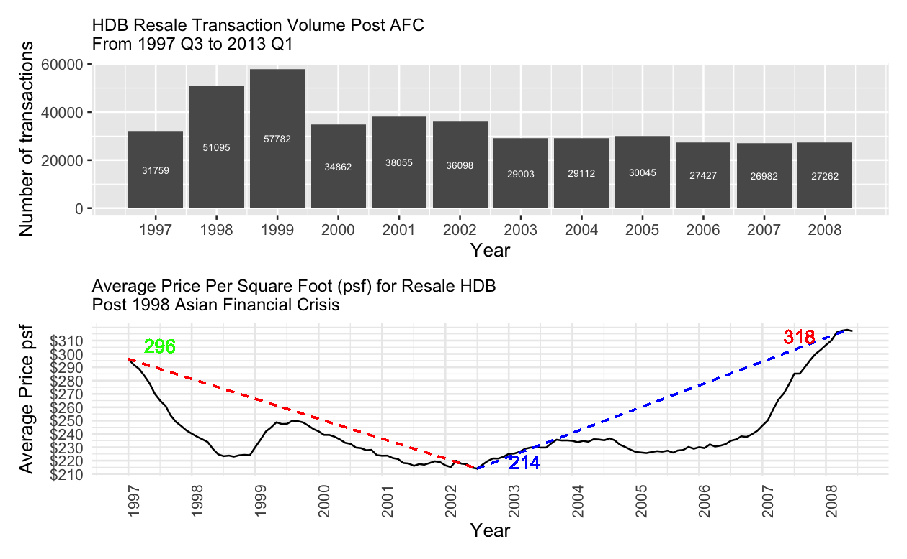

Filter data for another period of time.

``` {r plot.post.GFC, echo=F}
# Data engineer for line plot post GFC 2007 Q1 - 2012 Q4
# filter data from 2007 Q1 - 2012 Q4
post_gfc_df <- data[data$quarter >= "2007 Q1" & data$quarter <= "2012 Q4", ]

# create a new data frame and aggregrate dollar_psf by date
# to get the average psf for post GFC
post_gfc_psf_df <- post_gfc_df %>%
  group_by(month) %>%
  summarise(average_dollar_psf = mean(dollar_psf))

# create a transaction volume data frame for post GFC
txn_volume_post_gfc_df <- subset(txn_volume_df, 
                        year >= 2007 & year <= 2012)
```

Combine line plot and bar chart showing transaction volume and price psf post GFC.

```{r, echo=F}
# plot average_dollar_psf for 2007 Q1 - 2012 Q4 and assign to post_gfc_psf_plot to combine with other plot
post_gfc_psf_plot <- ggplot(post_gfc_psf_df, 
                            aes(x = month, 
                                y = average_dollar_psf)) +
  geom_line() +
  geom_segment(aes(x = min(month), 
                   y = min(average_dollar_psf),
                   xend = max(month), 
                   yend = max(average_dollar_psf)),
               linetype = "dashed", color = "red") +
  geom_text(aes(x = min(month), 
                y = round(min(average_dollar_psf)), 
                label = round(min(average_dollar_psf))),
            vjust = -1, 
            hjust = -0.5, 
            color = "red") +
  geom_text(aes(x = max(month), 
                y = round(max(average_dollar_psf)), 
                label = round(max(average_dollar_psf))),
            vjust = 1.5, 
            hjust = 0.5, 
            color = "red") +
  scale_y_continuous(labels = scales::dollar_format(prefix = "$"), 
                     breaks = seq(0, 
                                  max(post_gfc_psf_df$average_dollar_psf), 
                                  by = 20)) +
  scale_x_date(breaks = seq(as.Date("2007-01-01"), 
                            as.Date("2012-12-31"), 
                            by = "1 years"), 
               date_labels = "%Y") +
  labs(title = "Average Price psf for Resale HDB Flat Types\nPost GFC From 2007 Q1 to 2012 Q4",
       x = "Year",
       y = "Average Price psf") +
  theme_minimal() +
  theme(axis.text.x = element_text(angle = 90, 
                                   hjust = 1),
        plot.title = element_text(size = 10))  # Rotate x-axis labels for better visualization

# create txn_volume_plot for post GFC
txn_volume_post_gfc_plot <- ggplot(txn_volume_post_gfc_df, 
                          aes(y = num_txn, 
                              x = year)) + 
  geom_bar(position = "stack", 
           stat = "identity") +
  geom_text(aes(label = num_txn), 
            position = position_stack(vjust = 0.5), 
            color = "white", 
            size = 3) +  # Adjust the size as needed
  scale_x_continuous(breaks = seq(min(txn_volume_post_gfc_df$year), 
                                  max(txn_volume_post_gfc_df$year), 
                                  by = 1)) +
  labs(title = "HDB Resale Transaction Volume Post GFC\nFrom 2007 Q1 to 2012 Q4",
       x = "Year",
       y = "Number of transactions") +
  theme(plot.title = element_text(size = 10))


# Arrange both plots one on top of another using patchwork
combined_gfc_psf_plots <- txn_volume_post_gfc_plot / post_gfc_psf_plot

# Display the combined plots
combined_gfc_psf_plots
```

Output:

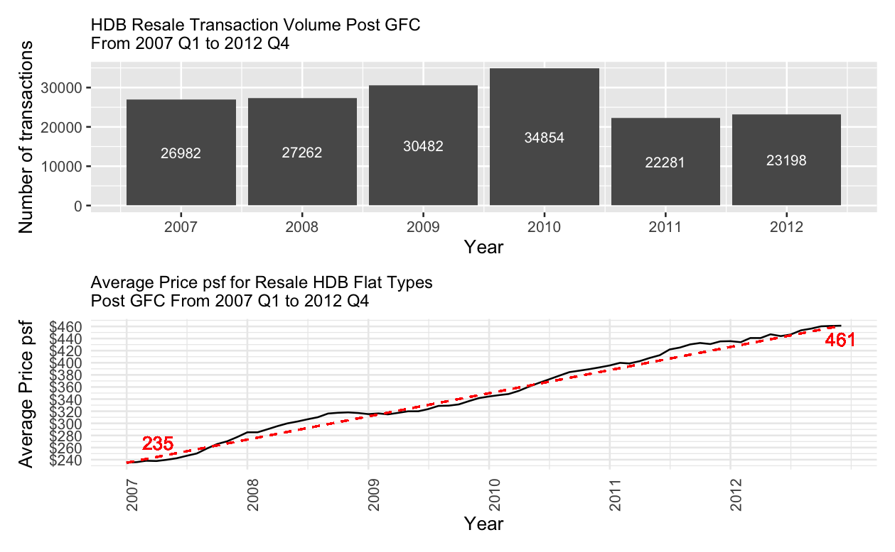

Filter data for another period of time

```{r after.2012, echo=F}
##### line plot for 2012-2023 #####
# Data engineer for line plot post from 2012-2023
# filter data from 2012 Q1 - 2023 Q4
after_2012_df <- data[data$quarter >= "2012 Q1" & data$quarter <= "2023 Q4", ]

# create a new data frame and aggregrate by date
# to get the average psf for 2012-2023
after_2012_psf_df <- after_2012_df %>%
  group_by(month) %>%
  summarise(average_dollar_psf = mean(dollar_psf))

# transaction volume from 2012 to 2023
txn_volume_after2012_df <- subset(txn_volume_df, 
                        year >= 2012 & year <= 2023)
```

Combine line plot and bar chart showing transaction volume and price psf post cooling measures.

```{r, echo=F}
# create a new data frame and aggregrate by date
# to get the average psf for 2012-2023
after_2012_psf_df <- after_2012_df %>%
  group_by(month) %>%
  summarise(average_dollar_psf = mean(dollar_psf))

after_2012_psf_plot <- ggplot(after_2012_psf_df, 
                            aes(x = month, 
                                y = average_dollar_psf)) +
  geom_line() +
  scale_y_continuous(labels = scales::dollar_format(prefix = "$"), 
                     breaks = seq(0, 
                                  max(after_2012_psf_df$average_dollar_psf), 
                                  by = 20)) +
  scale_x_date(breaks = seq(as.Date("2012-01-01"), 
                            as.Date("2023-12-31"), 
                            by = "1 years"), 
               date_labels = "%Y") +
  labs(title = "Average Price Per Square Foot (psf) for Resale HDB Flat\nFrom 2012-2023",
       x = "Year",
       y = "Average Price psf") +
  theme_minimal() +
  theme(axis.text.x = element_text(angle = 90, 
                                   hjust = 1),
        plot.title = element_text(size = 10))  # Rotate x-axis labels for better visualization

# create txn_volume_plot for 1990 to 2023
txn_volume_after2012_plot <- ggplot(txn_volume_after2012_df, 
                                   aes(y = num_txn, 
                                       x = year)) + 
  geom_bar(position = "stack", 
           stat = "identity") +
  geom_text(aes(label = num_txn), 
            position = position_stack(vjust = 0.5), 
            color = "white", 
            size = 3,
            angle = 90) +  # label chart 90 degree
  scale_x_continuous(breaks = seq(min(txn_volume_after2012_df$year), 
                                  max(txn_volume_after2012_df$year), 
                                  by = 1)) +
  labs(title = "HDB Resale Transaction Volume\nFrom 2012-2023",
       x = "Year",
       y = "Number of transactions") +
  theme(plot.title = element_text(size = 10),
        axis.text.x = element_text(angle = 90, 
                                   hjust = 1))

# Arrange both plots one on top of another using patchwork
combined_after2012_plots <- txn_volume_after2012_plot / after_2012_psf_plot

# Display the combined plots
combined_after2012_plots
```

Output:

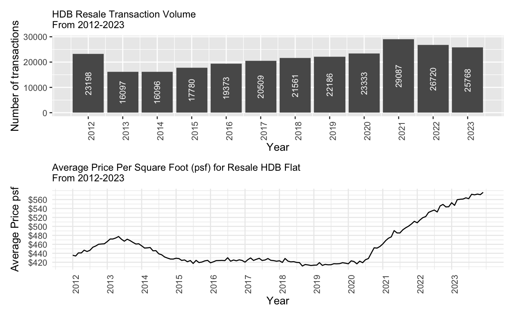

Filter data based on flat type

``` {r plot.post.covid, echo=F}
##### data processing for the line plot from 2020-present #####
# filter data from 2020-present
post_covid_df <- data[data$quarter >= "2020 Q1" & data$quarter <= "2023 Q4", ]

# create a new data frame and aggregrate by date 
# to get the average psf for post Covid-19
post_covid_psf_df <- post_covid_df %>%
  group_by(month) %>%
  summarise(average_dollar_psf = mean(dollar_psf))

# filter data based on flat type
post_covid_df <- data %>% 
  group_by(month, flat_type) %>% 
  summarise(num_txn = n()) # to prevent error message

txn_volume_post_covid_df <- subset(post_covid_df, 
                        month >= "2020-01-01" & month <= "2023-12-31")
```

```{r, echo=F}
##### line plot for post covid #####
# assign the ggplot to post_covid_psf_plot so it can be combined with other plot later on
post_covid_psf_plot <- ggplot(post_covid_psf_df, aes(x = month, y = average_dollar_psf)) +
  geom_line() +
  geom_segment(aes(x = min(month), 
                   y = average_dollar_psf[1],
                   xend = max(month), 
                   yend = tail(average_dollar_psf, 1)),
               linetype = "dashed", color = "red") +
  geom_text(aes(x = min(month), 
                y = round(min(average_dollar_psf)), 
                label = round(min(average_dollar_psf))),
            vjust = -2, 
            hjust = 0, 
            color = "red") +
  geom_text(aes(x = max(month), 
                y = round(max(average_dollar_psf)), 
                label = round(max(average_dollar_psf))),
            vjust = 1.5, 
            hjust = 0.5, 
            color = "red") +
  scale_y_continuous(labels = scales::dollar_format(prefix = "$"), 
                     breaks = seq(0, max(post_covid_psf_df$average_dollar_psf), by = 20)) +
  labs(title = "Average Price Per Square Foot (psf) for Resale HDB Post Covid-19\nFrom 2020 Q1 to 2023 Q4",
       x = "Year",
       y = "Average Price psf") +
  theme_minimal() +
  theme(axis.text.x = element_text(angle = 90, hjust = 1))  # Rotate x-axis labels for better visualization

# create txn_volume_plot for post covid
txn_volume_post_covid_plot <- ggplot(txn_volume_post_covid_df, 
                          aes(fill = flat_type,
                              y = num_txn, 
                              x = month)) + 
  geom_bar(position = "stack", 
           stat = "identity") +
  labs(title = "HDB Resale Transaction Volume Post Covid-19\nFrom 2020 Q1 to 2023 Q4",
       x = "Year",
       y = "Number of transactions") +
  theme(legend.key.size = unit(0.1, "cm"))  # Adjust the size as needed

# Arrange both plots one on top of another using patchwork
combined_covid_psf_plots <- txn_volume_post_covid_plot / post_covid_psf_plot

# Display the combined plots
combined_covid_psf_plots
```

Output:


Next, scatter plots of average price psf per remaining lease year of a flat will be shown to find out the depreciation rate of Singapore resale HDB, especially for 3-room, 4-room and 5-room flats.

Following is the list of data processing before plotting:

  * New data frames will be created to filter different types of flat for year 2019-2023. The average price psf of these flats are grouped by remaining_lease and computed using mean(). They are assigned to age_3room_df, age_4room_df and age_5room_df. See below for the snippet of code.

``` {r data.process.age.plot, echo=T}
##### Data Processing #####
# Filter out the flat type and the data in the last 5 years
age_3room_df <- data %>% 
  filter(format(month, "%Y") %in% c("2019", "2020", "2021", "2022", "2023")) %>%
  filter(flat_type %in% "3 ROOM") %>%
  group_by(remaining_lease) %>% 
  summarise(average_dollar_psf = mean(dollar_psf))

age_4room_df <- data %>% 
  filter(format(month, "%Y") %in% c("2019", "2020", "2021", "2022", "2023")) %>%
  filter(flat_type %in% "4 ROOM") %>%
  group_by(remaining_lease) %>% 
  summarise(average_dollar_psf = mean(dollar_psf))

age_5room_df <- data %>% 
  filter(format(month, "%Y") %in% c("2019", "2020", "2021", "2022", "2023")) %>%
  filter(flat_type %in% "5 ROOM") %>%
  group_by(remaining_lease) %>% 
  summarise(average_dollar_psf = mean(dollar_psf))
```

Scatter Plot:

``` {r age.plot.show.code, echo=T}
##### 3-ROOM scatter plot #####
ggplot(age_3room_df, 
       aes(x = remaining_lease, 
           y = average_dollar_psf)) + 
  geom_point() +
  geom_smooth(method = "lm", formula = y ~ poly(x, degree = 2), se = FALSE, color = "blue") +  # Add polynomial trend line
  labs(title = "Average Price psf For Resale HDB Per Remaining Lease Year\n3-Room Flat For 2019-2023",
       x = "Remaining Lease Year",
       y = "Average Price psf (SGD)") +
  scale_x_reverse(breaks = seq(0, 
                               max(age_3room_df$remaining_lease), 
                               by = 10)) +
  theme(plot.title = element_text(size = 10),  # Adjust the title size
        axis.title.x = element_text(size = 10),  # Adjust x-axis label size
        axis.title.y = element_text(size = 10))  # Adjust y-axis label size

##### 4-ROOM scatter plot #####
ggplot(age_4room_df, 
       aes(x = remaining_lease, 
           y = average_dollar_psf)) + 
  geom_point() +
  geom_smooth(method = "lm", formula = y ~ poly(x, degree = 2), se = FALSE, color = "blue") +  # Add polynomial trend line
  labs(title = "Price psf For Resale HDB Per Remaining Lease Year\n4-Room Flat For 2019-2023",
       x = "Remaining Lease Year",
       y = "Average Price psf (SGD)") +
  scale_x_reverse(breaks = seq(0, 
                               max(age_4room_df$remaining_lease), 
                               by = 10)) +
  theme(plot.title = element_text(size = 10),  # Adjust the title size
        axis.title.x = element_text(size = 10),  # Adjust x-axis label size
        axis.title.y = element_text(size = 10))  # Adjust y-axis label size

##### 5-ROOM scatter plot #####
ggplot(age_5room_df, 
       aes(x = remaining_lease, 
           y = average_dollar_psf)) + 
  geom_point() +
  geom_smooth(method = "lm", formula = y ~ poly(x, degree = 2), se = FALSE, color = "blue") +  # Add polynomial trend line
  labs(title = "Price psf For Resale HDB Per Remaining Lease Year\n5-Room Flat For 2019-2023",
       x = "Remaining Lease Year",
       y = "Average Price psf (SGD)") +
  scale_x_reverse(breaks = seq(0, 
                               max(age_5room_df$remaining_lease), 
                               by = 10)) +
  theme(plot.title = element_text(size = 10),  # Adjust the title size
        axis.title.x = element_text(size = 10),  # Adjust x-axis label size
        axis.title.y = element_text(size = 10))  # Adjust y-axis label size
```

Output:

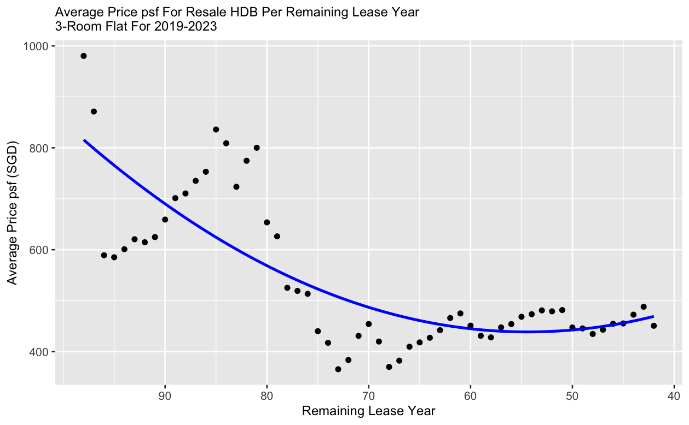 |   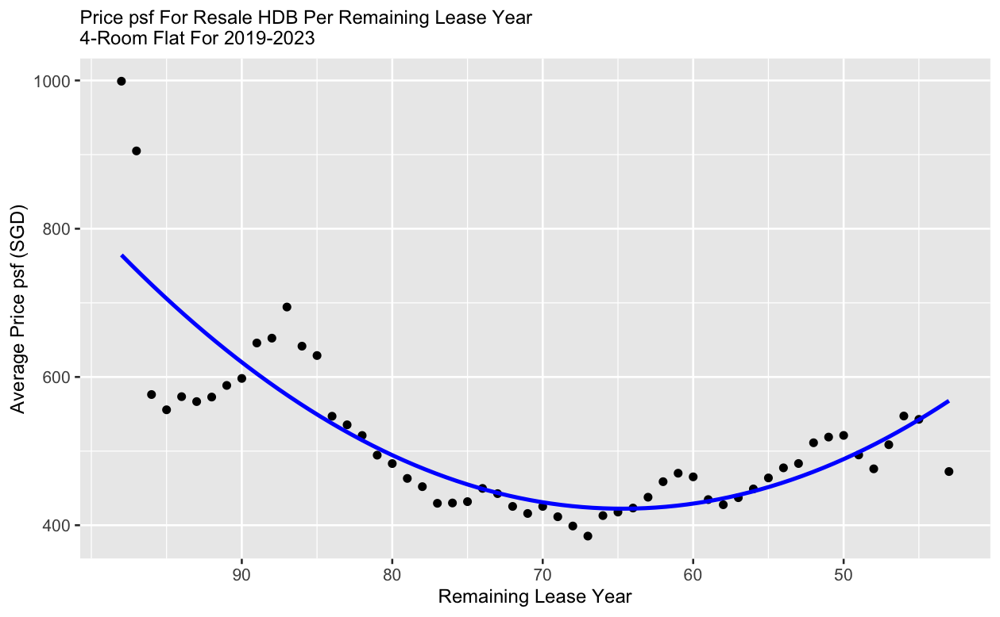 |   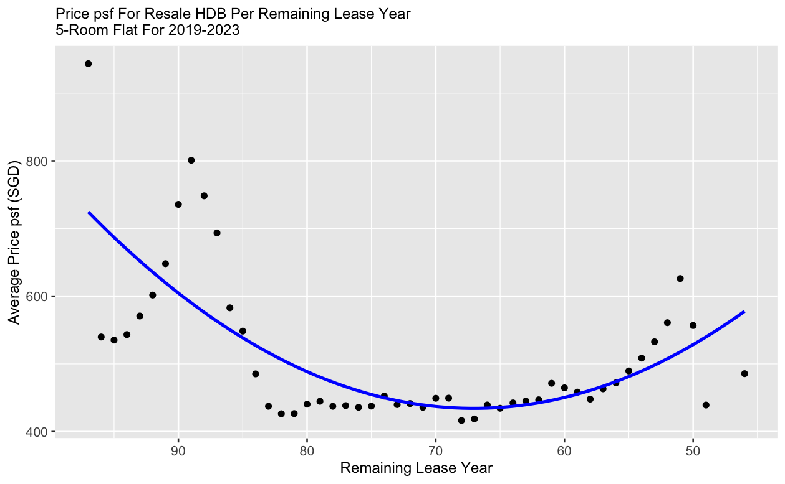

The Bala's Curve method stands out as a widely adopted approach for assessing leasehold value. This methodology states that depreciation intensifying as the lease approaches its conclusion. The presented scatter plots depict transactions for 3-room, 4-room and 5-room flats across different age groups. The rest of the flat types are not included due to insufficient transactions during the filtered year duration, making it insignificant to the analysis. The observed polynomial trend line exhibits a pattern resembling a linear to inverted U curve. This implies that the rate of price reduction remains consistent or decelerates as the property ages, in contrast to the accelerating inverted U shape observed in Bala's Curve.

Next, line plot will be used to see the average resale price trend of different flat types from 1990 to present.

``` {r general.line.plot.2, echo=F}
# Relationship Between Average Resale Prices and Flat Model
ggplot(data, aes(x = month, 
                 y = resale_price, 
                 group = flat_type, 
                 color = flat_type)) +
  stat_summary(fun.y = "mean", 
               geom = "line", 
               size = 0.5) +
  scale_y_continuous(labels = scales::dollar_format(prefix = "$"), breaks = seq(0, max(data$resale_price), by = 50000)) +
  scale_x_date(breaks = seq(as.Date("1990-01-01"), as.Date("2024-02-01"), by = "5 years"), date_labels = "%Y") +
  labs(title = "Average Resale Price for Different HDB Flat Types\nFrom 1990 to Present",
       x = "Year",
       y = "Average Resale Price (SGD)") +
  theme_minimal() +
  theme(plot.title = element_text(size = 10),
        axis.title.x = element_text(size = 8),  # Adjust the x-axis label size
        axis.title.y = element_text(size = 8), # Adjust the y-axis label size
        axis.text.x = element_text(angle = 90, hjust = 1, size = 5),
        axis.text.y = element_text(size = 5),
        legend.key.size = unit(0.05, "cm"),  # Adjust the size as needed
        legend.text = element_text(size = 8))  # Adjust the legend text size
```

Output:

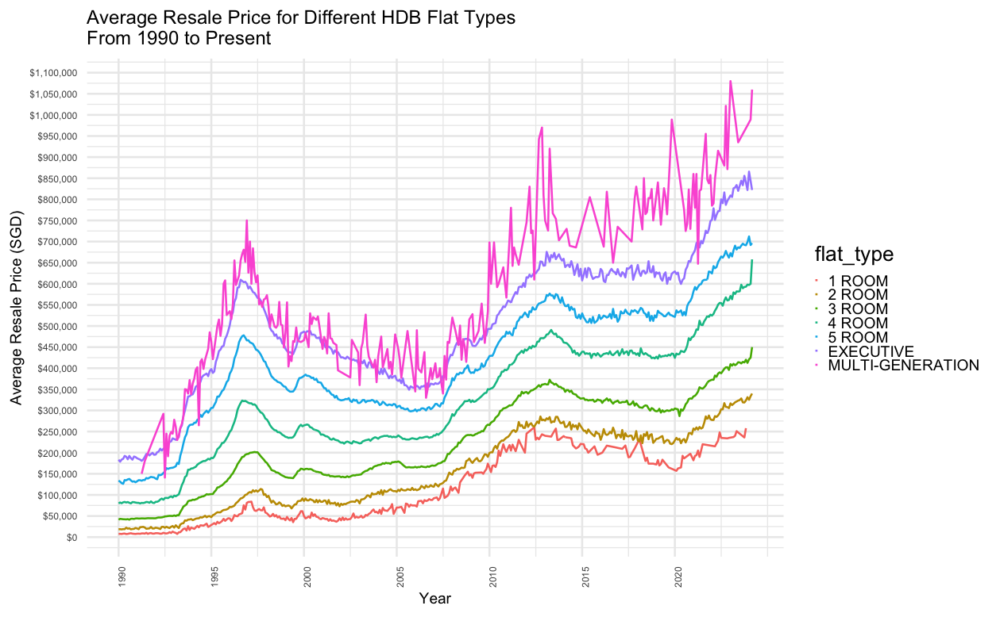

The average resale price of the multi-generation flat is more volatile. This could be due to small amount of transaction for this type of flat.

Filter data by flat type.

``` {r data.processing.txn.vol, echo=T}
flat_type_df <- data %>% 
  group_by(flat_type) %>% 
  summarise(num_txn = n())
```

Plot the transaction volume for each flat type from 1990 onwards.

``` {r txn.vol.bar.chart, echo=F}
ggplot(flat_type_df,
       aes(fill = flat_type,
           x = flat_type,
           y = num_txn / 1000)) + 
  geom_bar(stat = "identity", 
           position = "stack") +
  geom_text(aes(label = num_txn), 
            position = position_stack(vjust = 0.5), 
            color = "black", 
            size = 2) +
  labs(title = "HDB Resale Transaction Volume of Different Flat Types\nFrom 1990-Present",
       x = "Flat Type",
       y = "Number of Transactions (in 1000)") +
  scale_y_continuous(labels = scales::comma_format(scale = 1)) +
  theme(axis.text.x = element_text(angle = 90, hjust = 1),
        plot.title = element_text(size = 10))  # Rotate x-axis labels for better visual
```

Output:

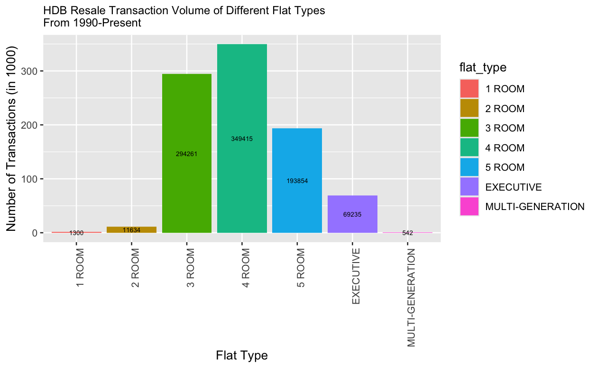

The number of transaction for "MULTI-GENERATION" flat type is only 542 from 1990 to present, shown by the bar chart above. The bar chart also shows that 4-room flat is the most transacted.

Next, boxplot will be used to see the relationship between the resale prices and flat type.

```{r flat.model.resale.price.boxplot, echo=T}
# filter data from 2023 Q1 - 2024 Q1
flat_model_df <- data %>% 
  filter(format(month, "%Y") %in% c("2023", "2024")) %>%
  filter(flat_type %in% c("3 ROOM", "4 ROOM", "5 ROOM", "EXECUTIVE")) 

# Plotting boxplot for resale prices by flat type and label median
ggplot(flat_model_df, aes(x = flat_type, y = resale_price)) +
  geom_boxplot(fill = "skyblue", color = "black") +
  stat_summary(fun = "median", geom = "text", aes(label = paste("Median:", round(..y.., 2))),
               position = position_dodge(width = 0.75), vjust = -0.5, size = 3) +  # Add median label
  labs(title = "Boxplot: Resale Prices by Flat Type\nFrom 2023-Present",
       x = "Flat Type",
       y = "Resale Price (SGD)") +
  theme_minimal() +
  theme(axis.text.x = element_text(angle = 90, hjust = 1)) +
  scale_y_continuous(breaks = seq(0, max(flat_model_df$resale_price), by = 100000),
                     labels = scales::comma,
                     minor_breaks = seq(0, max(flat_model_df$resale_price), by = 10000))
```

Output:

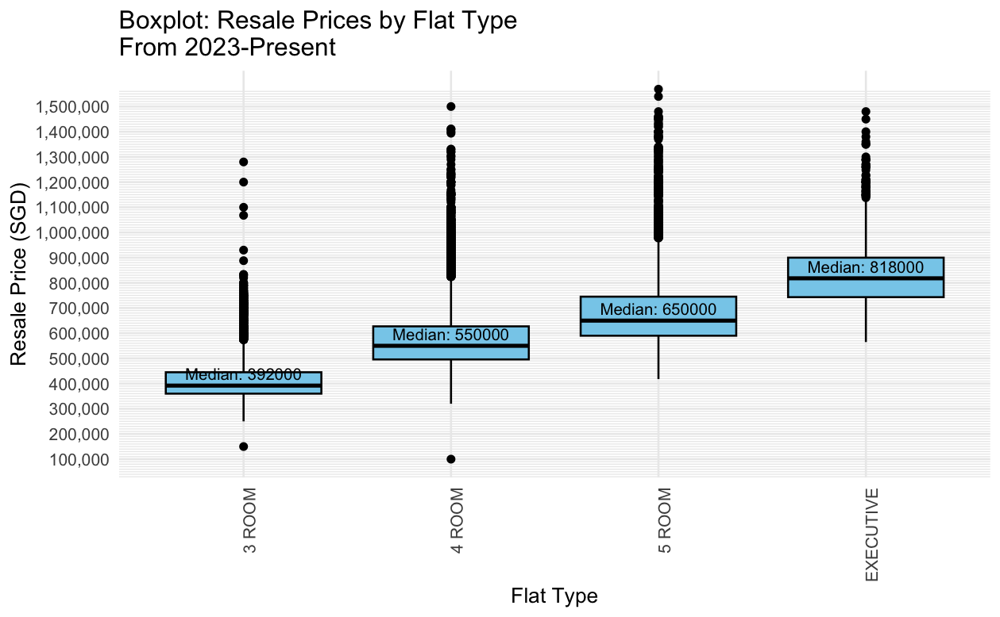

From the boxplot, there are many outliers for all the flat types. This shows that the same flat type can vary in resale price based on location and floor area. 

Next, using the same flat_model_df, the scatter plot below, illustrated using geom_point(), proves that the same floor area can have various resale prices. This could be due to difference in location. Some locations could have higher resale price than the others.

```{r floor.size.resale.price, echo=F}
ggplot(flat_model_df, aes(x = floor_area_sqm, y = resale_price)) +
  geom_point(color = "blue") +
  labs(title = "Scatter Plot: Resale Prices vs. Floor Area\nFrom 2023-Present",
       x = "Floor Area (sqm)",
       y = "Resale Price (SGD)") +
  theme_minimal()
```

Output:

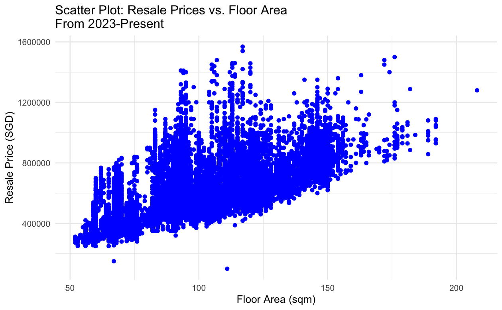

Next, map plot will be used to show how price psf varies for different areas in Singapore from 2020 onwards.

Data processing steps taken:

  * create a data frame "map_data_df" to subset data from 2020 onwards.
  * marking the map by creating data frame "lat_lon_map_df" with town, and latitude and longitude. The latitude and longitude of each town are populated by extracting it from google map manually.
  * calculate the average price psf group by town, summarise() and mean() and assign to new data frame "town_price_psf_df"
  * merge the "town_price_psf_df" with "lat_lon_map_df" by "town".
  * create a new variable called "color_to_plot" to categorize prices into 3. If the average price psf is more than equal to 600, it will be set as red, If the average price psf is more than equal to 500, it will be set as green, If the average price psf is more than equal to 400, it will be set as yellow.

Data Processing:

``` {r data.processing.map.leaflet.plot, echo=F}
# Filter year from the main data
map_data_df <- subset(data, month > "2020-01-01")

# marking the map by creating data frames with town, and lat long
town <- c("ANG MO KIO", "BEDOK", "BISHAN", "BUKIT BATOK", "BUKIT MERAH", "BUKIT PANJANG", 
          "BUKIT TIMAH", "CENTRAL AREA", "CHOA CHU KANG", "CLEMENTI", "GEYLANG", "HOUGANG", 
          "JURONG EAST", "JURONG WEST", "KALLANG/WHAMPOA", "MARINE PARADE", "PASIR RIS", "PUNGGOL", 
          "QUEENSTOWN", "SEMBAWANG", "SENGKANG", "SERANGOON", "TAMPINES", "TOA PAYOH", 
          "WOODLANDS", "YISHUN")

lat <-c(1.3691275, 1.3234583, 1.3506286, 1.3490395, 1.2835189, 1.3781962, 
        1.3301289, 1.2960918, 1.3889474, 1.3151795, 1.3171468, 1.3717871, 
        1.3337862, 1.3393132, 1.3106797, 1.3027887, 1.3733546, 1.4064128, 
        1.2995458, 1.4490698, 1.390879, 1.3514605, 1.3526767, 1.3352485, 
        1.4378143, 1.4300536)

lon <-c(103.8454939, 103.9271546, 103.8475392, 103.7494611, 103.820135, 103.7700594, 
        103.792448, 103.8479968, 103.743734, 103.7649734, 103.8867987, 103.8919224, 
        103.7417185, 103.7070628, 103.8650184, 103.9053028, 103.9492515, 103.9029414, 
        103.7997241, 103.8197324, 103.8948787, 103.8697044, 103.9454262, 103.8494389, 
        103.7885617, 103.8353864)    

lat_lon_map_df <- data.frame(town, lat, lon)

town_price_psf_df <- map_data_df %>% 
  group_by(town) %>% 
  summarise(average_dollar_psf = mean(dollar_psf),
            num_of_records = n())

# merge town_price_psf_df and lat_lon_map
town_price_psf_df <- merge(town_price_psf_df, lat_lon_map_df, by = "town")

# create color_to_plot variable
town_price_psf_df$color_to_plot <- ifelse(town_price_psf_df$average_dollar_psf >= 600, "red",
                                     ifelse(town_price_psf_df$average_dollar_psf >= 500, "green",
                                            ifelse(town_price_psf_df$average_dollar_psf >= 400, "yellow", town_price_psf_df$color_to_plot)))
```

Leaflet code snippet:

``` {r map.leaflet.plot, echo=F}
#install.packages("leaflet")
library(leaflet)

# use popup to show label
leaflet(town_price_psf_df) %>% 
  addProviderTiles(providers$OpenStreetMap) %>% 
  addCircleMarkers(~lon, ~lat, color = ~color_to_plot, radius = 50, popup = ~paste("Town: ", town, "<br> Average PSF: $", round(average_dollar_psf)))
```

Output:

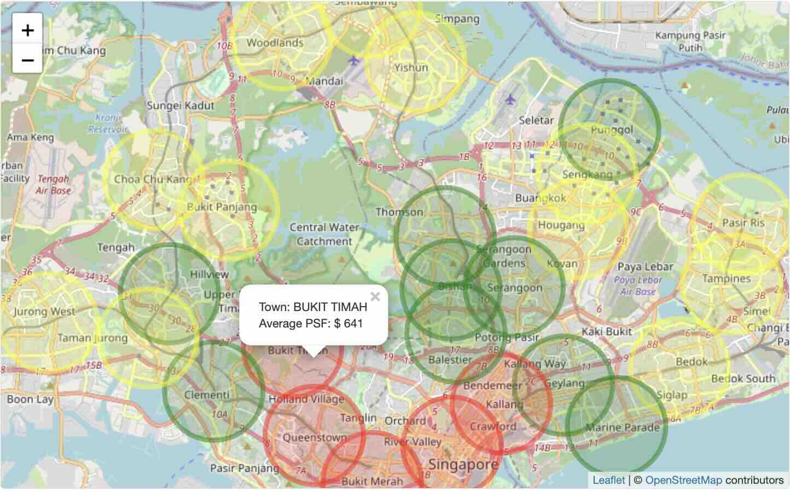

The map plot above is illustrated using leaflet package. The addProviderTiles(providers$OpenStreetMap) is used to show the Singapore map. The addCircleMarkers() is used to show the colored circles on each town. The average price psf will be shown when clicking on the colored circles. From the map plot, it is observed that the areas on the edges have lower average price psf shown by yellow circles. The average price psf increase as the circles move into the centre of Singapore. The areas with red circles have highest average price psf. Therefore, location is prime factor for estimating average price psf.

# Conclusion
In summary, these visualizations offer valuable insights for stakeholders, providing information on potential changes in the average prices per square foot of resale HDB during financial crises or events affecting interest rates. Prospective buyers can explore areas within their budget, considering that different locations exhibit distinct average price psf patterns.
